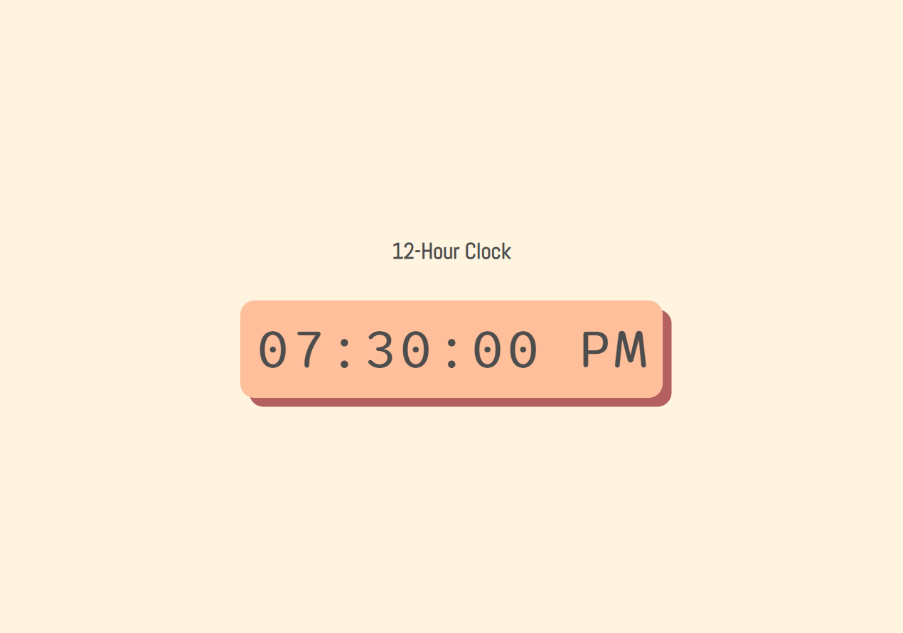

## Table of Contents

- [Screenshot](#screenshot)
- [Link](#link)
- [Built With](#built-with)
- [Source Help](#source-help)
- [Author](#author)

### Screenshot

## Link
- [Live Link](https://marianellag1.github.io/current-clock/)

## Built With
 
 - HTML
 - CSS
 - JavaScript

## Source Help

- [flexiple](https://flexiple.com/javascript/javascript-clock/) - Had a great thurough example and guide, with step by step help of code.

- [geeksforgeeks](https://www.geeksforgeeks.org/how-to-design-digital-clock-using-javascript/) - a quick pseudo code list of what I should do, without the help of an actual code. It's great as if to challenge myself on what I understand of javascript, and be able to make the clock project.

- [w3schools](https://www.w3schools.com/js/tryit.asp?filename=tryjs_timing_clock) - I was able to compare to flexiple, as they were similar, only difference was on how flexiple used the meridiem on the clock, not w3school.

- [w3schools](https://www.w3schools.com/jsref/tryit.asp?filename=tryjsref_comparison) - JavaScript comparisons = The ? : Operator

## Author

Marianella Gamboa
